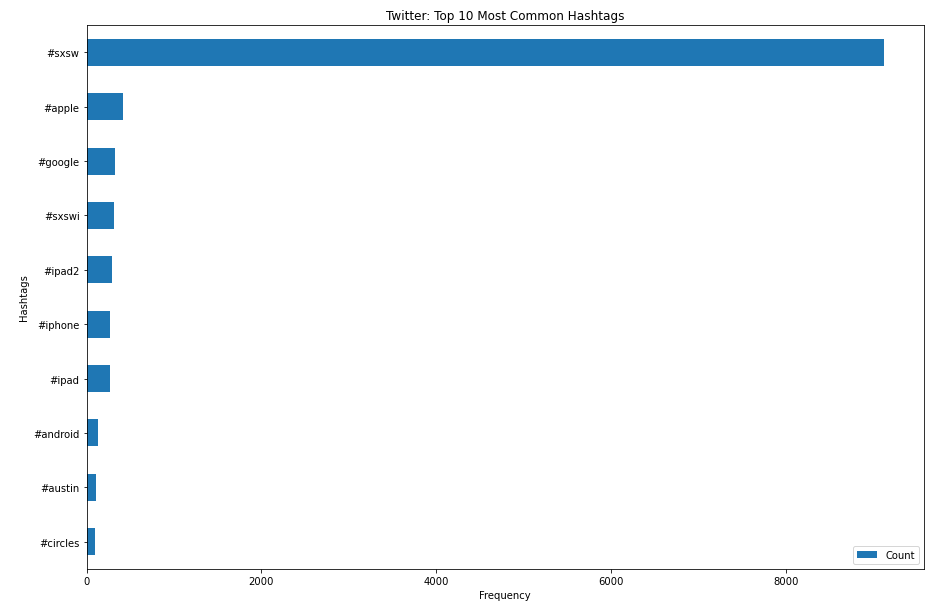
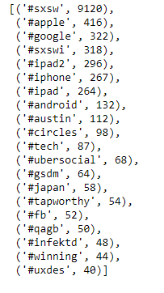
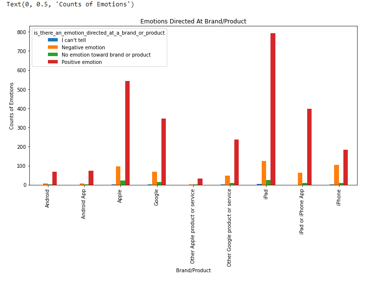
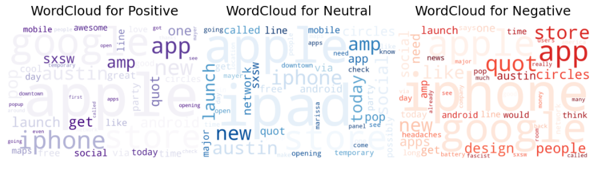
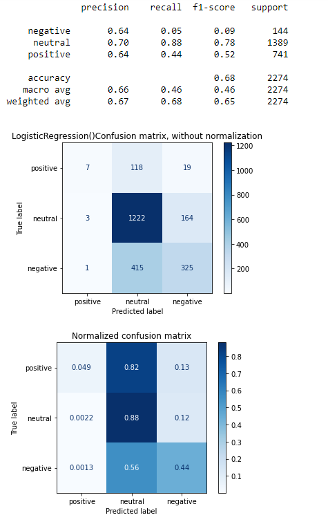

# Phase 4 Npl Twitter Sentiments

<b>Build a model that can rate the sentiment of a Tweet based on its content.</b>

# Data:
All the data came from https://data.world/crowdflower/brands-and-product-emotions:
It contained over <b>9k</b> data points and three columns below:
* tweet_text - the tweet from twitter
* emotion_in_tweet_is_directed_at - the product/brand
* is_there_an_emotion_directed_at_a_brand_or_product - the emotion of tweet

# Observations:

## What are the most common hashtags?

**The most common is SXSW which is an event that was happening at the time of these tweets. Its an event thats full of conferences and festivals that deal with technology, filming, and music. Apple and Google are right behind of course being the subject of these tweets.** 

## Which products have the most positive/negative comments?

**Overall Apple/products seems to have more tweets then Google, which means they have more positive tweets as well. It looks like ~14% of the tweets for Apple are negative where as ~20% of the tweets for Google are negative.**

## What are the common words overall?

**So of course the most frequent words are the brands we're focused on: google and apple. Then we get some products and descriptions such as iPad, iPhone, new, and free.**

## What are some common words for each emotion?

**We can see words like amp, awesome, and great in the positive word clouds. Temporary, network, need in neutral word clouds. Long, line, headaches in negative word clouds. You can also see there are common words among all the word clouds, meaning that words alone can have a lot of different meaning. We need to get more context from each tweet to understand the reasoning of the sentiment.**

# Recommendations:
**LOGISTIC REGRESSION**

* <b>Highest score for accuracy, precision, and recall.</b>
* <b>Very effective for text data.</b>

